# 🎮 VR Mania Custom POS System

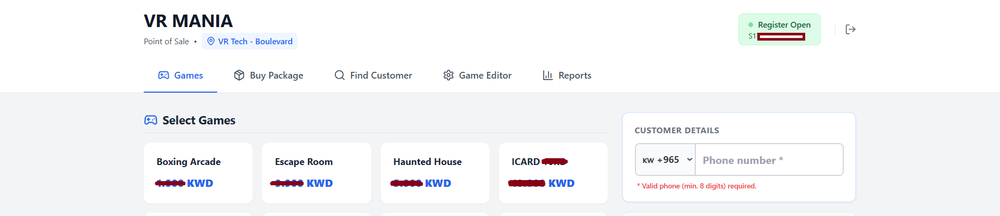

> A custom enterprise Point of Sale (POS) and business management platform developed for **VR Mania Kuwait**, powering multi-branch operations, customer package management, financial reporting, and real-time business analytics.

---

# 📖 Project Overview

The **VR Mania Custom POS System** is a comprehensive business management solution designed specifically for VR entertainment centers.

Built from the ground up, the platform manages daily operations across multiple branches, providing secure role-based access, customer package management, payment processing, financial reporting, game redemption, and real-time business analytics.

The application was developed with scalability, security, and operational efficiency in mind, allowing multiple employee roles to work simultaneously while sharing live data through Supabase.

> **Note**
>
> The source code is proprietary and owned by the company. This repository is published solely as a portfolio showcase and contains screenshots and documentation only.

---

# 🚀 Technologies

| Technology | Purpose |
|------------|---------|
| React 18 | Frontend Framework |
| TypeScript | Static Typing |
| Vite | Development & Build Tool |
| Tailwind CSS | Styling |
| Supabase | PostgreSQL Database & Authentication |
| PostgreSQL | Relational Database |
| Netlify Functions | Serverless Backend |
| Twilio API | WhatsApp Notifications |
| QRCode | Digital Package Redemption |
| Lucide React | Icons |

---

# 🏗 System Architecture

```text
VR MANIA CUSTOM POS
│
├── Authentication
│
├── Cashier POS
│
├── Customer Management
│
├── Package & QR Redemption
│
├── Payment Processing
│
├── Accountant Dashboard
│
├── Reports
│
├── Settlement System
│
├── Admin Panel
│
├── Multi-Branch Management
│
├── WhatsApp Billing
│
└── Supabase Database
```

---

# ✨ Core Features

- Enterprise-grade Point of Sale
- Multi-Branch Support
- Role-Based Access Control (RBAC)
- Secure Authentication
- Customer Package Management
- QR Code Package Redemption
- Mobile Redemption Portal
- Multi-Tender Payment Processing
- Automated WhatsApp Receipts
- Financial Reporting
- Real-Time Analytics
- Daily Settlement System
- Customer Search
- Manual Game Injection
- Game Package Management
- Live Database Synchronization
- CSV Report Export
- Responsive Dashboard

---

# 🔐 User Roles

The system includes dedicated interfaces for:

- Cashiers
- Accountants
- Mobile Scanners
- Administrators

Each role has isolated permissions and access to only the features required for daily operations.

---

# 💳 Payment System

Supports multiple payment methods including:

- Cash
- K-Net
- iCard
- Sheel
- Kidden

Features include:

- Split payments
- Automatic tax calculation
- Quantity aggregation
- Real-time totals
- Receipt generation

---

# 🎟 Customer Package System

Customers can purchase game packages that include:

- QR Code generation
- Digital package tracking
- Remaining balance monitoring
- Mobile redemption
- Manual package adjustments
- Game redemption history

---

# 📊 Financial Analytics

The Accountant Dashboard provides:

- Daily revenue tracking
- Branch comparison
- Date filtering
- Settlement calculations
- Cash drawer reconciliation
- CSV exports
- Sales reports
- Live financial statistics

---

# ☁️ Backend & Database

Powered by Supabase PostgreSQL.

Features include:

- Authentication
- Real-time database listeners
- Relational data modeling
- Foreign key constraints
- Secure Row Level Security
- Live synchronization
- SQL-based reporting

---

# 📲 Automated Communications

Integrated with Twilio using Netlify Serverless Functions to provide:

- WhatsApp electronic receipts
- Automated billing notifications
- Secure API communication
- CORS-free serverless architecture

---

# 📸 Screenshots

## Login

Secure authentication with role-based access for Cashiers, Accountants, Mobile Scanners, and Administrators.

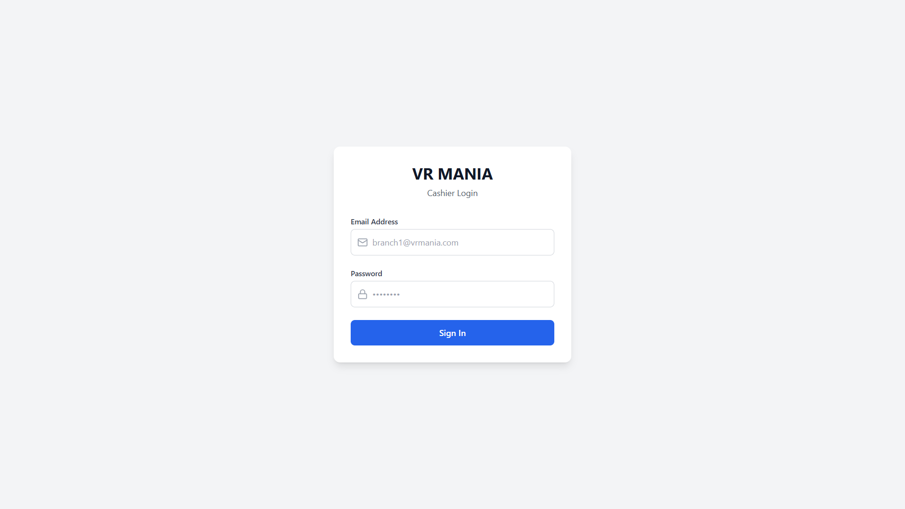

---

## Point of Sale

The primary cashier interface for creating orders, selecting games, and processing customer purchases.

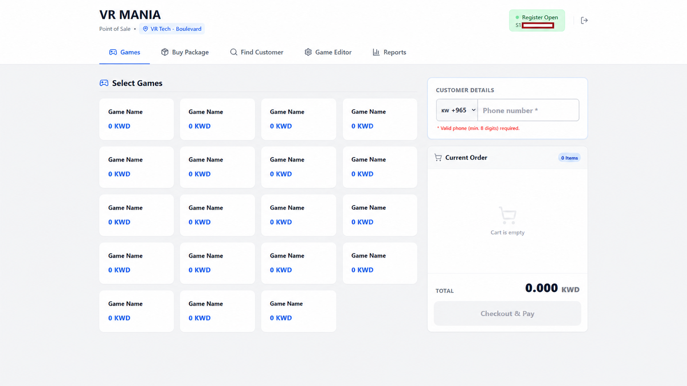

---

## Shopping Cart

Dynamic cart with automatic totals, quantity calculations, taxes, and package management.

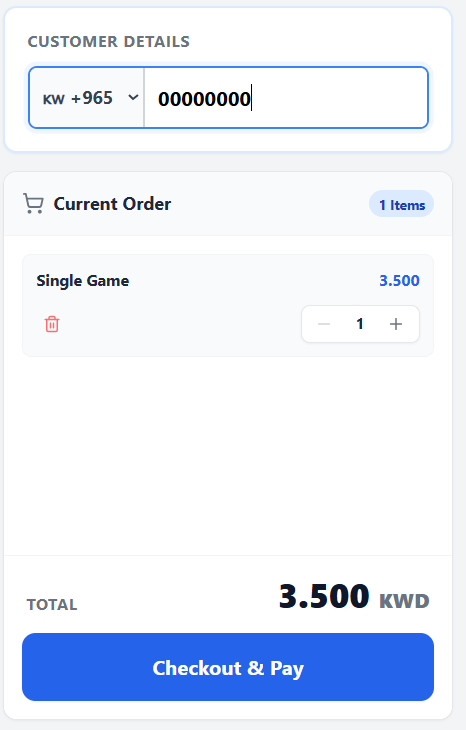

---

## Buy Package

Create customer game packages with configurable pricing and balance tracking.

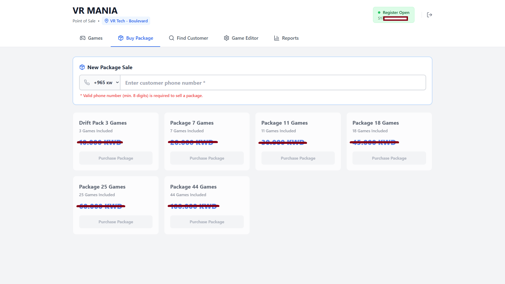

---

## Payment Processing

Supports multiple payment methods, split payments, and automatic receipt generation.

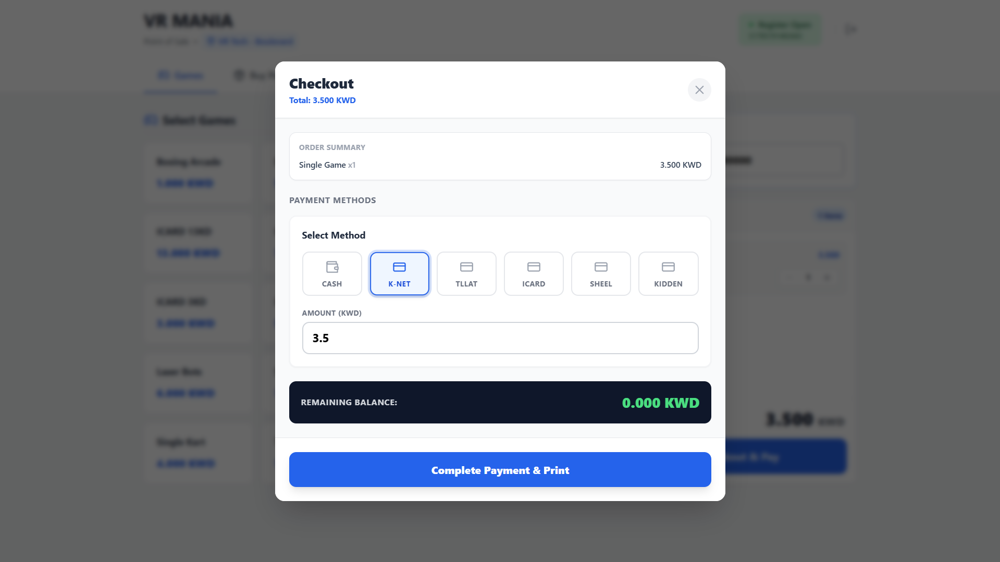

---

## Customer Search

Quickly locate existing customers, review packages, and manage account information.

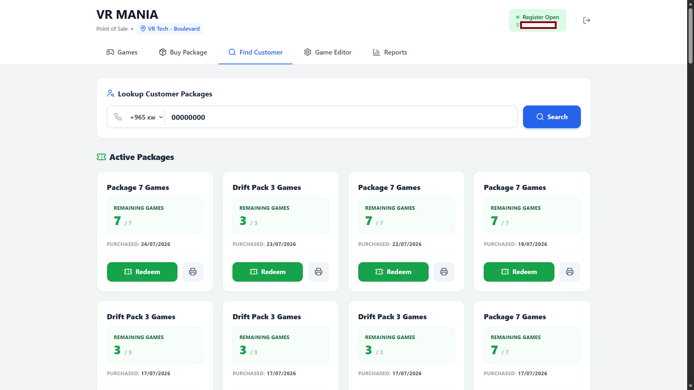

---

## QR & POS Redemption

Flexible package redemption allowing staff to redeem customer games through QR code scanning on mobile devices or directly within the POS interface.

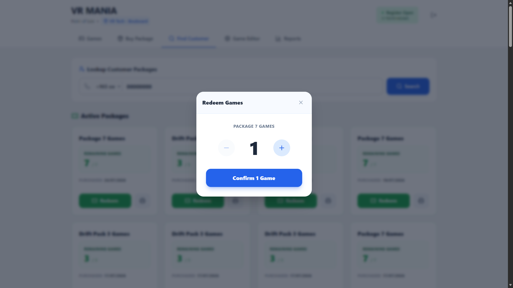

---

## Accountant Dashboard

Financial overview including revenue tracking, branch performance, and daily business metrics.

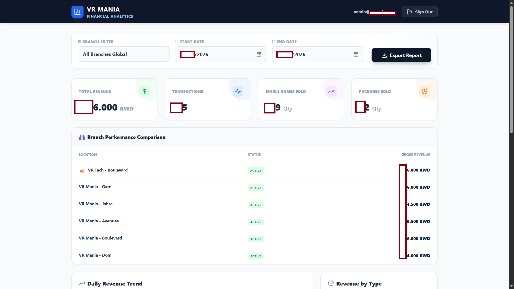

---

## Reports

Generate business reports with date filtering, exports, and operational summaries.

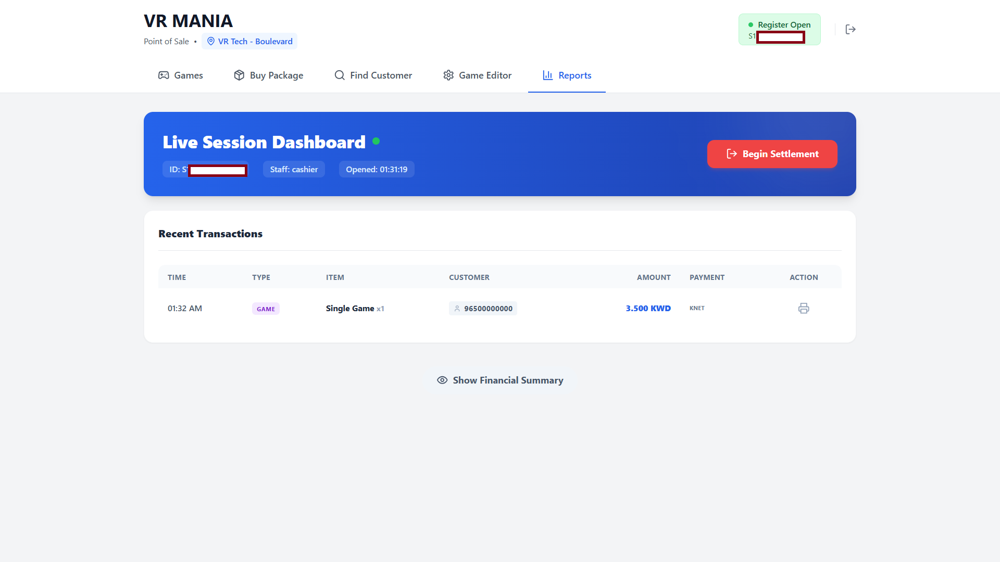

---

## Analytics

Real-time dashboards providing insights into sales performance and operational statistics.

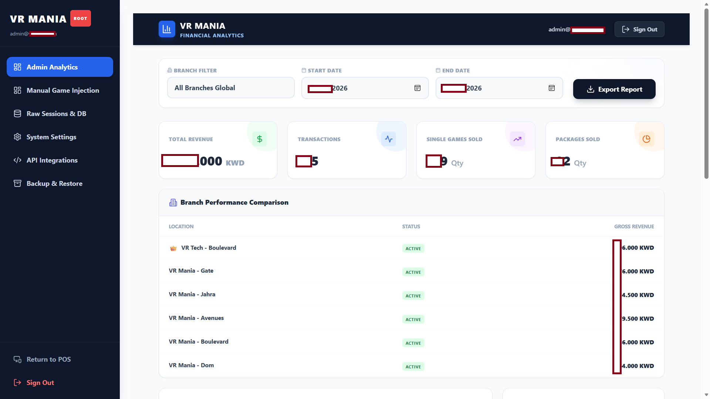

---

## API Integrations

Administration interface for managing third-party service integrations including WhatsApp billing.

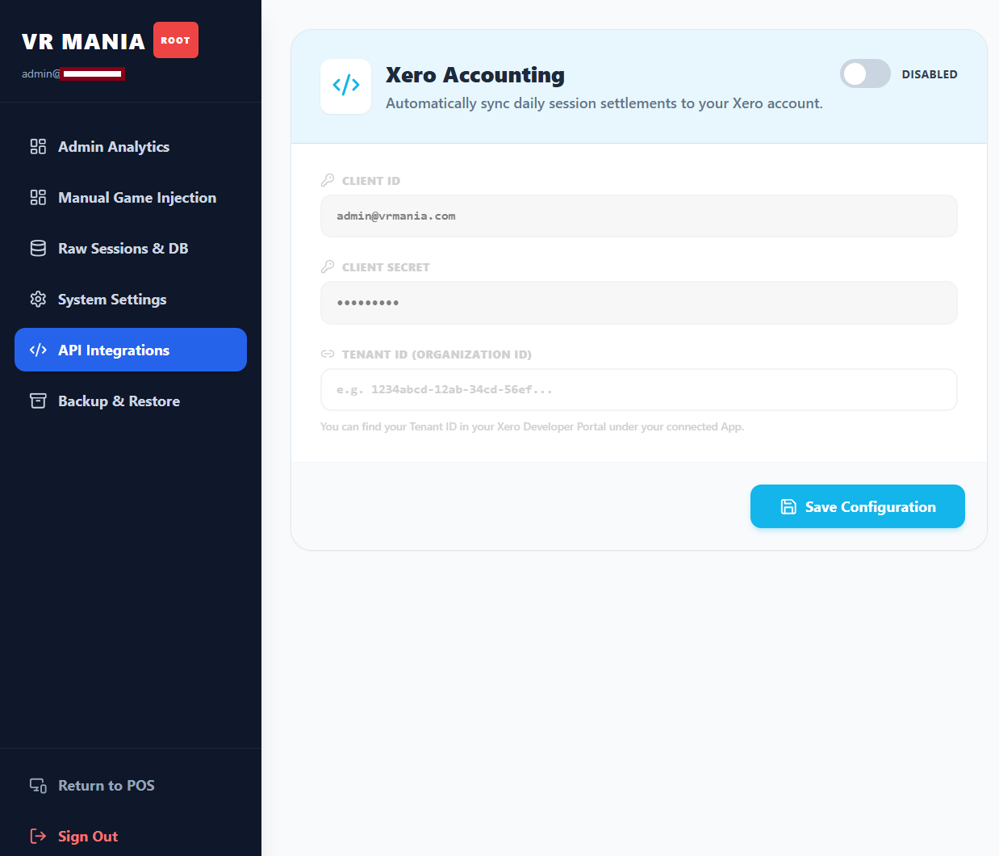

---

## Manual Game Injection

Administrative tool for manually assigning games or packages to customer accounts when required.

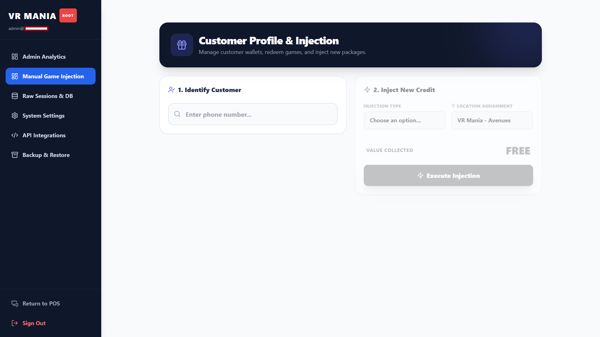

---

## Game Editor

Manage available games, pricing, package configuration, and product information.

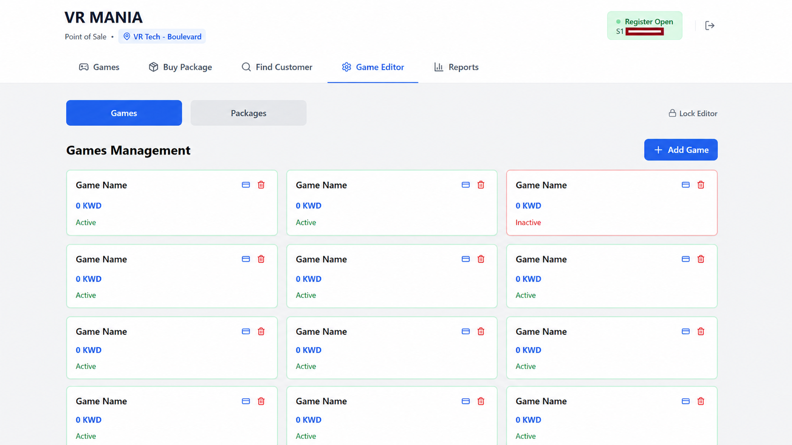

---

## Backup & Restore

Database backup and restoration tools for secure data management and disaster recovery.

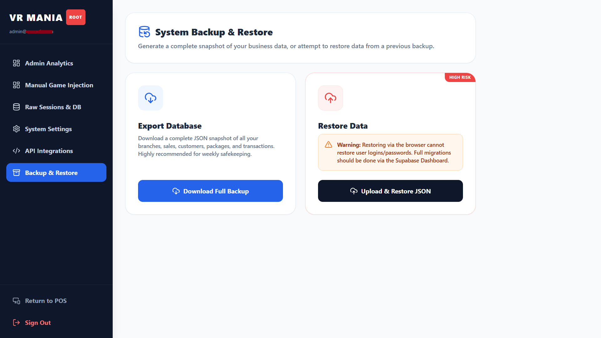

---

## Raw Sessions Database

Administrative interface for viewing and managing raw customer session records.

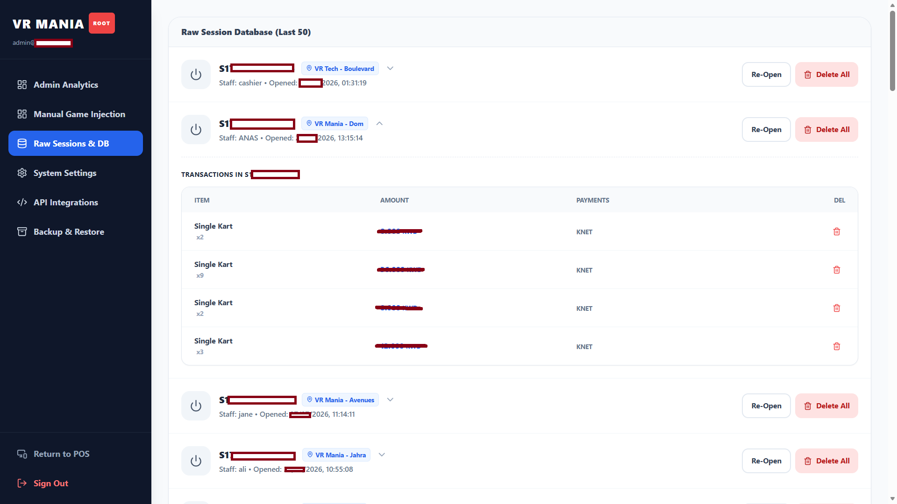

---

## Receipt Generation

Automatically generates professional receipts after each transaction, including purchased games, payment details, taxes, and transaction summaries for customers.

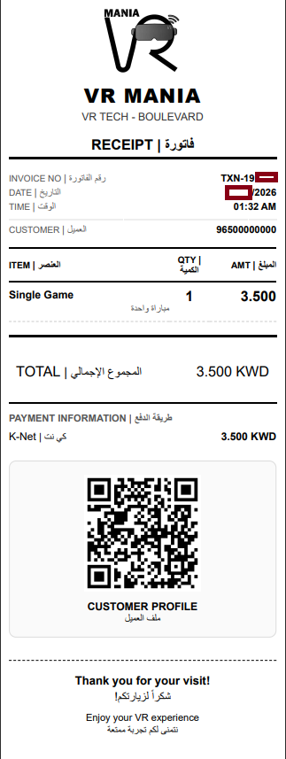

---

## Settlement

End-of-day cash drawer reconciliation with automated settlement calculations.

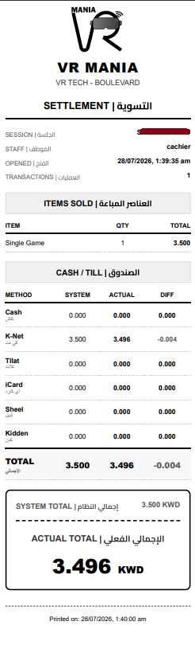

---

## Project Architecture

Overview of the project's modular architecture and component organization.

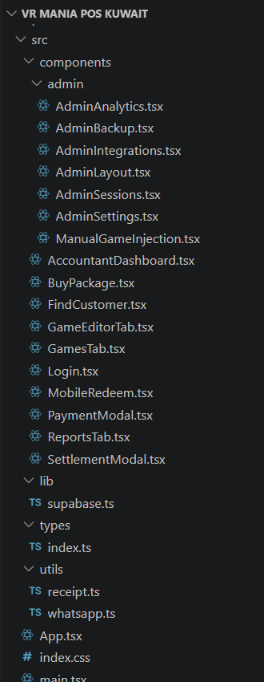
# 👨‍💻 My Contributions

As the Full-Stack Frontend Developer, I was responsible for:

- Architecting the complete frontend application
- Designing the POS workflow
- Developing reusable React components
- Implementing secure authentication
- Building role-based access control
- Developing customer package management
- Integrating Supabase PostgreSQL
- Writing SQL queries and database models
- Implementing QR code redemption
- Integrating Twilio WhatsApp notifications
- Developing the accountant dashboard
- Creating reporting and CSV exports
- Implementing daily settlement calculations
- Optimizing application performance
- Preparing the platform for production deployment

---

# 🛠 Built With

- React
- TypeScript
- Vite
- Tailwind CSS
- Supabase
- PostgreSQL
- Netlify Functions
- Twilio API
- QRCode
- Lucide React

---

# 🔒 Source Code

The complete source code is proprietary and remains the intellectual property of **VR Mania Kuwait**.

This repository is intended solely as a portfolio showcase and contains screenshots and project documentation.

No proprietary source code or confidential business logic is included.

---

# 📄 License

This repository is provided for portfolio and demonstration purposes only.

All trademarks, branding, source code, database structures, and implementation belong exclusively to **VR Mania Kuwait**.

Unauthorized reproduction or commercial use of the original project is prohibited.
